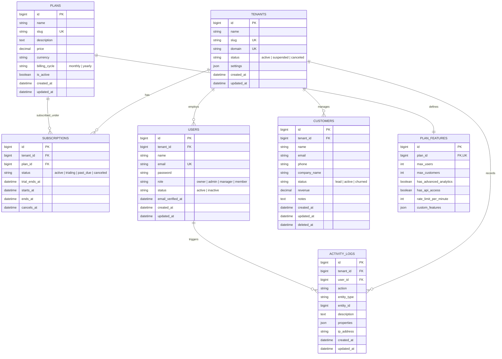

# Database Architecture & Schema Documentation

## 1. Architectural Strategy: Single Database with Column Scoping

For this multi-tenant SaaS application, we selected the **Single Shared Database with Column-Based Tenant Isolation (`tenant_id`)** pattern, augmented by **Eloquent Global Scopes (`TenantScope`)** and route/token context resolution.

### Why this pattern?
1. **Cost & Operational Efficiency:** A single database pool serves thousands of tenants without incurring the administrative, connection, and infrastructure overhead of spinning up a separate MySQL database or schema per tenant.
2. **Instant Onboarding:** New tenant registration executes in milliseconds via a single transaction without running external DDL migrations.
3. **Aggregated Cross-Tenant Analytics:** SaaS super-administrators can easily compute global platform metrics (e.g. platform MRR, active users) without complex cross-database federated queries.
4. **Reliable Connection Pooling:** Connection exhaustion is minimized under high concurrency, making the architecture highly scalable and resilient.

---

## 2. Entity-Relationship (ER) Diagram



---

## 3. Detailed Table Specifications & Constraints

### 3.1 `tenants`
| Column | Type | Nullable | Description & Constraints |
|---|---|---|---|
| `id` | BIGINT UNSIGNED | No | Primary Key |
| `name` | VARCHAR(255) | No | Company / Organization display name |
| `slug` | VARCHAR(100) | No | Unique URL-friendly identifier (`UNIQUE`) |
| `domain` | VARCHAR(255) | Yes | Custom domain or subdomain (`UNIQUE`) |
| `status` | VARCHAR(50) | No | Status: `active`, `suspended`, `canceled` (`INDEX`) |
| `settings` | JSON | Yes | Tenant preferences (timezone, currency, notifications) |
| `created_at`, `updated_at` | TIMESTAMP | Yes | Timestamps |

### 3.2 `plans` & `plan_features`
- `plans`: Master catalog of SaaS tiers (Free, Starter, Pro, Enterprise).
- `plan_features`: 1-to-1 table storing plan limits:
  - `max_users`: Maximum team members allowed under the plan.
  - `max_customers`: Maximum customer CRM records allowed.
  - `has_advanced_analytics`: Boolean feature flag.
  - `has_api_access`: Boolean feature flag.
  - `rate_limit_per_minute`: Dynamic API rate limit allocated to the tenant.

### 3.3 `subscriptions`
- Manages tenant subscription lifecycles.
- **Foreign Keys:**
  - `tenant_id` references `tenants(id)` on delete cascade.
  - `plan_id` references `plans(id)` on delete restrict.
- **Compound Index:** `[tenant_id, status]` for ultra-fast lookup of the tenant's current active plan.

### 3.4 `users`
- Stores tenant owners, administrators, managers, and team members.
- **Foreign Keys:** `tenant_id` references `tenants(id)` on delete cascade.
- **Indexes:**
  - `[tenant_id, role]` for role-based queries.
  - `[tenant_id, status]` for active member filtering.
  - `email` unique index for global auth resolution.

### 3.5 `customers`
- Multi-tenant CRM entity storing clients/leads managed by each tenant.
- Includes `SoftDeletes` (`deleted_at`) for audit compliance and recovery.
- **Compound Indexes:**
  - `[tenant_id, status]` for status filtering (lead, active, churned).
  - `[tenant_id, created_at]` for chronologically paginated lists.
  - `[tenant_id, email]` for tenant-scoped email lookups.
  - `[tenant_id, deleted_at]` for soft-delete filtering.

### 3.6 `activity_logs`
- Append-only audit trail logging entity changes, subscription upgrades, and user creations.
- **Index:** `[tenant_id, created_at]` ensuring fast retrieval of the latest dashboard events.

---

## 4. Tenant Isolation Enforcement Mechanism

1. **`TenantContext` Singleton:** A thread-safe in-memory context store holding the resolved `Tenant` model for the current HTTP request lifecycle.
2. **`TenantScope` Eloquent Global Scope:**
   ```php
   public function apply(Builder $builder, Model $model): void
   {
       if (TenantContext::hasTenant()) {
           $builder->where($model->getTable() . '.tenant_id', TenantContext::getId());
       }
   }
   ```
3. **`BelongsToTenant` Model Trait:**
   - Automatically registers `TenantScope`.
   - On the `creating` event, automatically populates `$model->tenant_id = TenantContext::getId()` if not manually set.
4. **Multi-Layer Zero-Leak Guarantee:**
   - Even if a developer writes `Customer::where('status', 'active')->get()`, the query automatically compiles to:
     `SELECT * FROM customers WHERE status = 'active' AND customers.tenant_id = 1 AND customers.deleted_at IS NULL`
   - Cross-tenant queries are blocked at both the database query generation level and the Laravel Policy authorization level.
